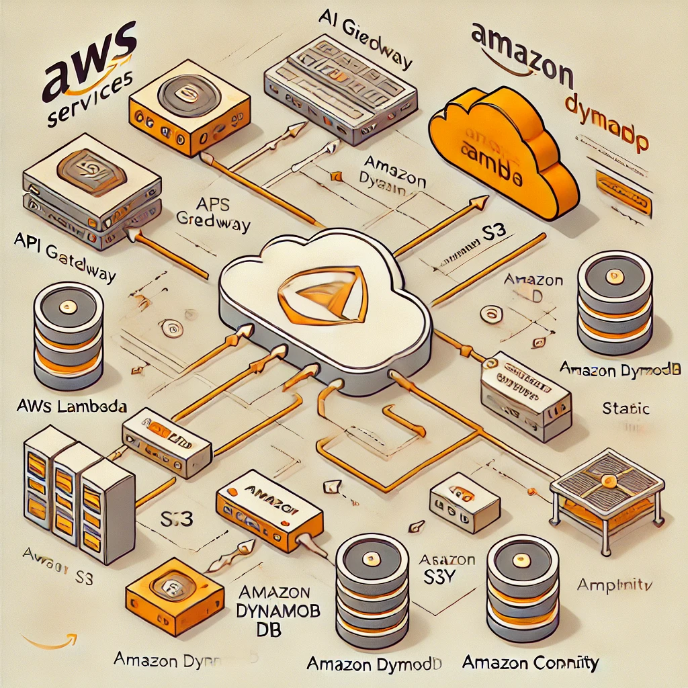

# Serverless Web Application for Real-Time Data Processing

This project is a serverless web application that processes and displays real-time data from a public API. It leverages various AWS services to provide a scalable, efficient, and secure application.

## Architecture

The application uses the following AWS services:

- **Amazon API Gateway**: To create RESTful endpoints for the application.
- **AWS Lambda**: To process data from the public API.
- **Amazon DynamoDB**: To store processed data.
- **Amazon S3**: To host static front-end files.
- **AWS Amplify**: To manage front-end deployment.
- **Amazon Cognito**: For user authentication.



## Features

- Real-time data processing from a public API.
- Serverless architecture for high scalability.
- User authentication with AWS Cognito.
- Static hosting and front-end deployment with AWS Amplify.

## Prerequisites

- AWS Account
- AWS CLI configured
- Node.js and npm installed
- Amplify CLI installed

## Setup and Deployment

### 1. Clone the Repository

```bash
git clone https://github.com/yourusername/real-time-data-processing.git
cd real-time-data-processing
```
