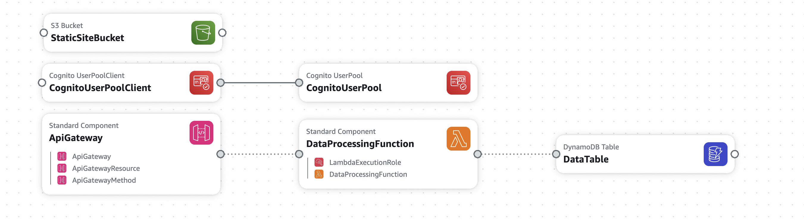

# Serverless Web Application for Real-Time Data Processing

This project is a serverless web application that processes and displays real-time data from a public API. It leverages various AWS services to provide a scalable, efficient, and secure application.

## Architecture

The application uses the following AWS services:

- **Amazon API Gateway**: To create RESTful endpoints for the application.
- **AWS Lambda**: To process data from the public API.
- **Amazon DynamoDB**: To store processed data.
- **Amazon S3**: To host static front-end files.
- **AWS Amplify**: To manage front-end deployment.
- **Amazon Cognito**: For user authentication.



## Features

- Real-time data processing from a public API.
- Serverless architecture for high scalability.
- User authentication with AWS Cognito.
- Static hosting and front-end deployment with AWS Amplify.

## Prerequisites

- AWS Account
- AWS CLI configured
- Node.js and npm installed
- Amplify CLI installed

## Setup and Deployment

### 1. Clone the Repository

```bash
git clone https://github.com/yourusername/real-time-data-processing.git
cd real-time-data-processing
```

### 2. Deploy CloudFormation Stack

Deploy the AWS resources using the provided CloudFormation template:

```bash
aws cloudformation create-stack --stack-name RealTimeDataProcessing --template-body file://cloudformation-template.yaml
```

### 3. Set Up the Frontend

Navigate to the frontend directory and install dependencies:

```bash
cd frontend
npm install
```

### 4. Deploy the Frontend

Use AWS Amplify to deploy the frontend:

```bash
amplify init
amplify add hosting
amplify publish
```

### 5. Configure Cognito

Set up an Amazon Cognito User Pool and integrate it with your front-end application by updating the configuration file.

## Usage

- Access the application through the Amplify-hosted URL.
- Sign up or log in using Cognito authentication.
- View real-time data updates on the dashboard.

## Contributing

Contributions are welcome! Please open an issue or submit a pull request.

## License

This project is licensed under the MIT License. See the [LICENSE](Licencse.md) file for details.
